# Lab Members

## Active (8)

| Name | Role | Email | Photo |
|---|---|---|---|
| [Benjamin Moody](benjamin-moody/person.yaml) | Research Engineer | bmoody@mit.edu |  |
| [Brian Gow](brian-gow/person.yaml) | Research Engineer | bgow@mit.edu | 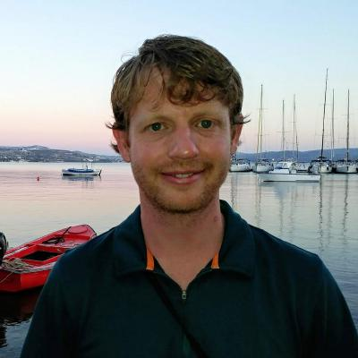 |
| [Jesse Raffa](jesse-raffa/person.yaml) | Research Scientist | jraffa@mit.edu | 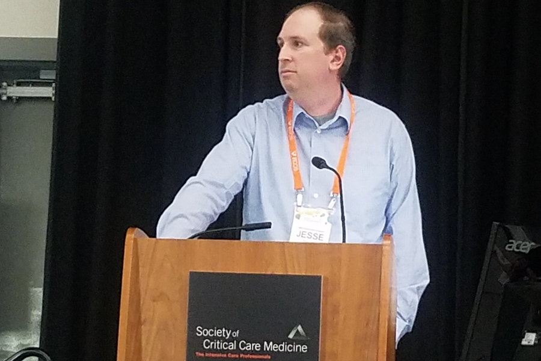 |
| [Kenneth Paik](kenneth-paik/person.yaml) | Research Scientist | kepaik@mit.edu | 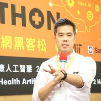 |
| [Leo Anthony Celi](leo-celi/person.yaml) | PI | lceli@mit.edu | 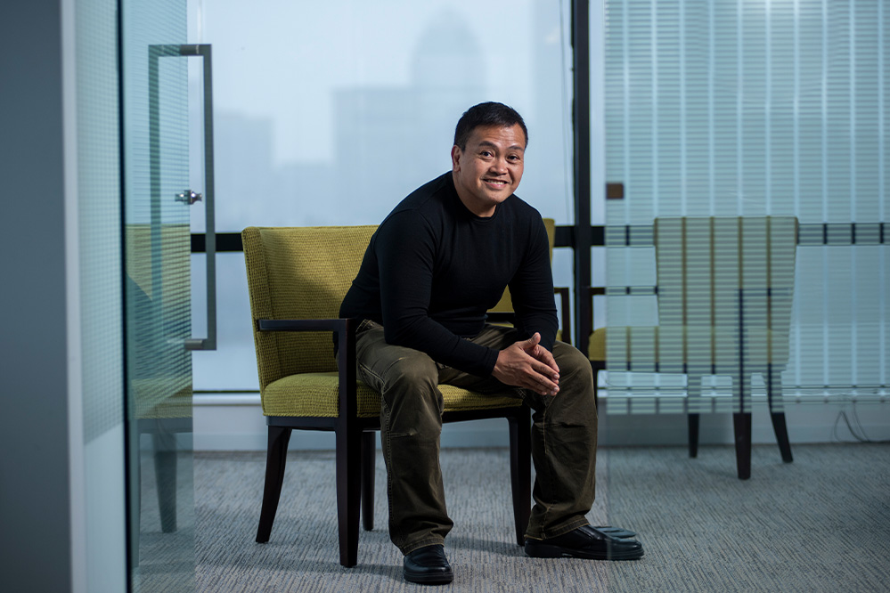 |
| [Li-wei Lehman](liwei-lehman/person.yaml) | Research Scientist | lilehman@mit.edu | 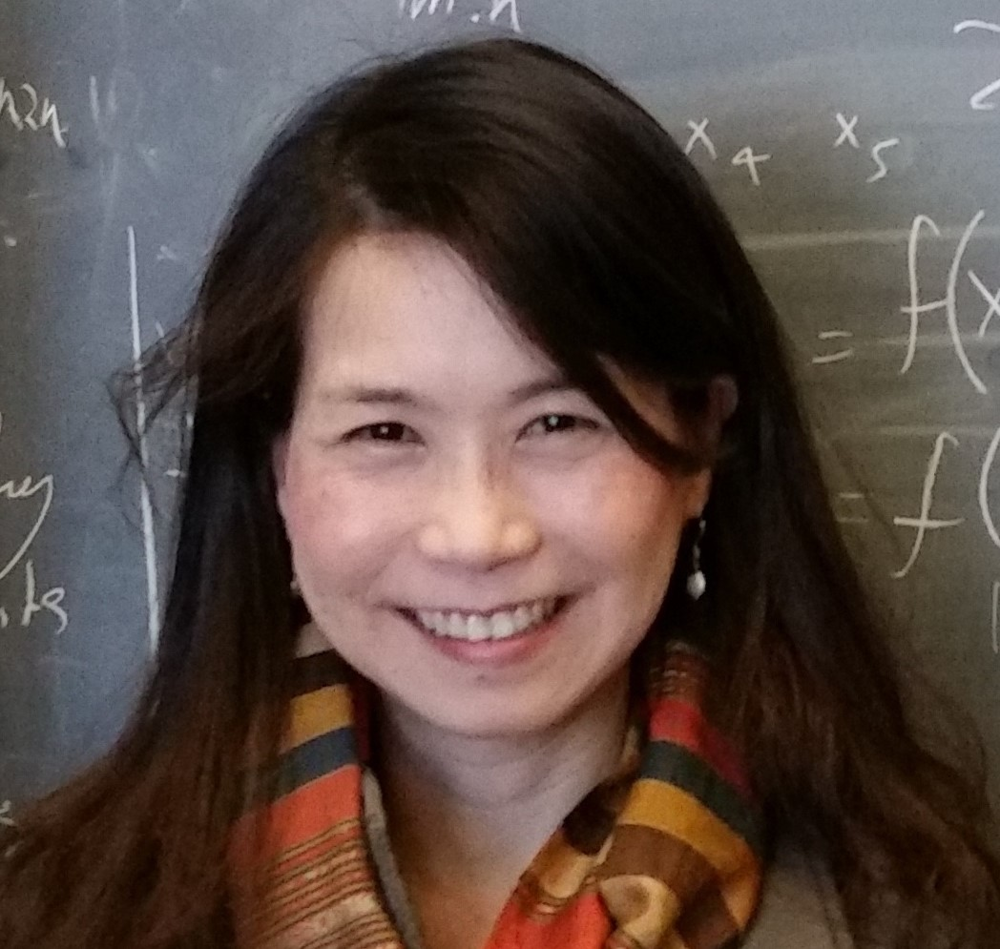 |
| [Roger Mark](roger-mark/person.yaml) | PI | rgmark@mit.edu | 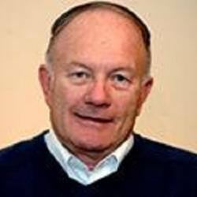 |
| [Tom Pollard](tom-pollard/person.yaml) | Research Scientist | tpollard@mit.edu | 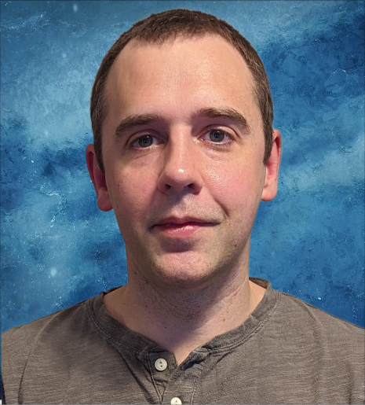 |

## Current Visitors & Collaborators (18)

| Name | Dates | Role | Institution | Email | Photo |
|---|---|---|---|---|---|
| [Ahram Han](ahram-han/person.yaml) | Sep 2024–Aug 2026 | Visiting Scientist | Seoul National University Hospital | ahramhan@mit.edu |  |
| [Aryan Bhattacharya](aryan-bhattacharya/person.yaml) | TBD | Affiliate |  |  |  |
| [Benet Fite Abril](benet-fite-abril/person.yaml) | TBD | PhD Student | Harvard | benet_fite@hms.harvard.com |  |
| [Boya Zhang](boya-zhang/person.yaml) | TBD | Visiting Scientist | MIT, UNIGE | boya_zh@mit.edu |  |
| [David Restrepo](david-restrepo/person.yaml) | TBD | Affiliate | CentraleSupélec -  Université Paris-Saclay | davidres@mit.edu |  |
| [Dimitrios Proios](dimitrios-proios/person.yaml) | TBD | Visiting Scientist | Faculty of Medicine Switzerland | dimi.proios@gmail.com |  |
| [Fredrik Willumsen Haug](fredrik-willumsen-haug/person.yaml) | TBD | PhD Student | Harvard | fredrik_willumsenhaug@college.harvard.edu |  |
| [Laurine Sprehe](laurine-sprehe/person.yaml) | TBD | PhD Student | MGH/HMS | lsprehe@mgh.harvard.edu |  |
| [Louis Agha-mir-Salim](louis-agha-mir-salim/person.yaml) | TBD | Affiliate |  |  |  |
| [Marlene Louisa Moerig](marlene-louisa-moerig/person.yaml) | TBD | Visiting Scientist | Charité | moerig@mit.edu |  |
| [Milit Patel](milit-patel/person.yaml) | TBD | Affiliate |  |  |  |
| [Rodrigo Gameiro](rodrigo-gameiro/person.yaml) | TBD | Visiting Scientist | Harvard Medical School | rrgmd@mit.edu |  |
| [Ryohei Kobayashi (Yamamoto)](ryohei-kobayashi-yamamoto/person.yaml) | Sep 2025–Aug 2027 | Visiting Scientist | Fukushima Medical University | royhei11@mit.edu | 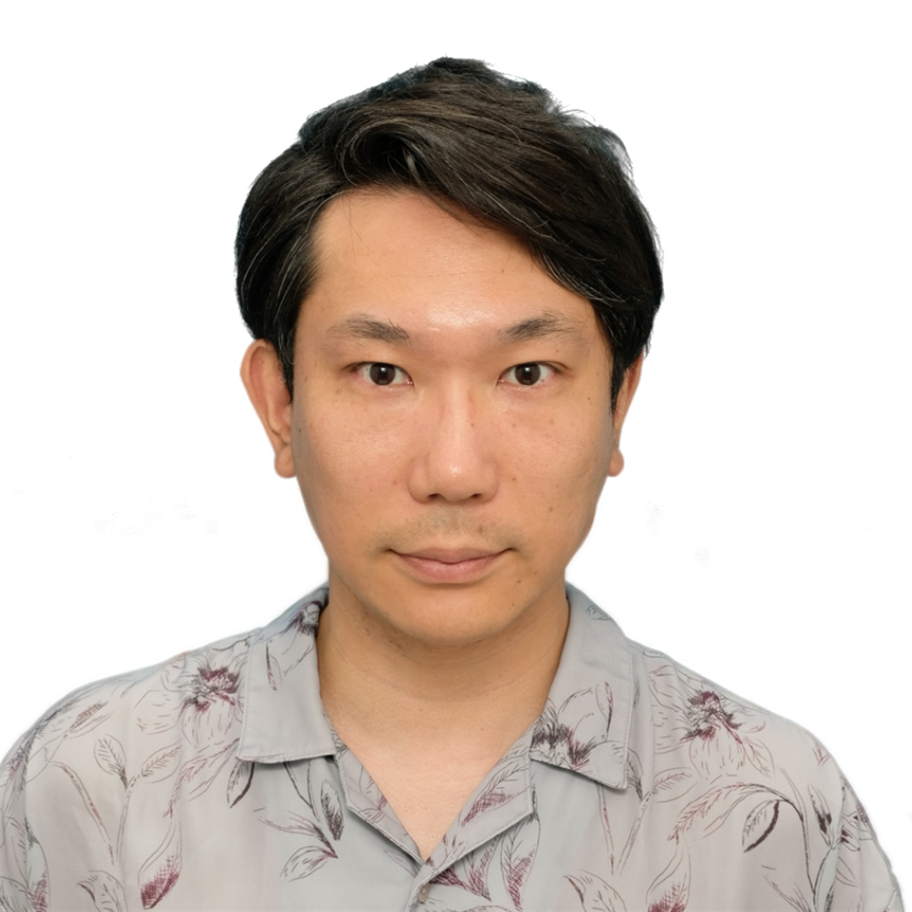 |
| [Saleem Ameen](saleem-ameen/person.yaml) | TBD | Visiting Scientist | University of Tasmania & Harvard Medical School | saleemam@mit.edu |  |
| [Sebastian Cajas](sebastian-cajas/person.yaml) | TBD | Affiliate | MIT Critical data | sebasmos@mit.edu |  |
| [Sebastien Emile](sebastien-emile/person.yaml) | Nov 2025–present | Visiting Scientist |  | lydrale@gmail.com | 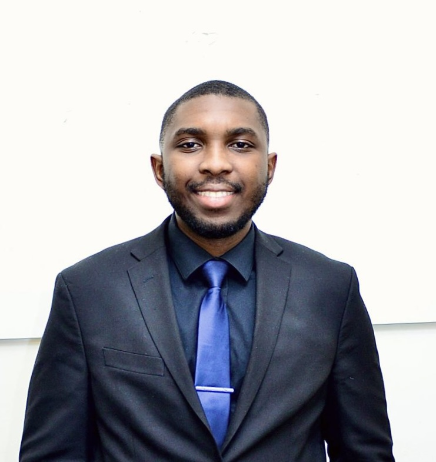 |
| [Tiger Krittaphas](tiger-krittaphas/person.yaml) | TBD | Affiliate |  |  |  |
| [Yugang Jia](yugang-jia/person.yaml) | TBD | Affiliate |  |  |  |

## Alumni (10)

| Name | Dates | Role | Institution | Email | Photo |
|---|---|---|---|---|---|
| [Dukyong Yoon](dukyong-yoon/person.yaml) | Mar 2025–Feb 2026 | Visiting Scholar | Yonsei University College of Medicine | ydy8302@mit.edu | 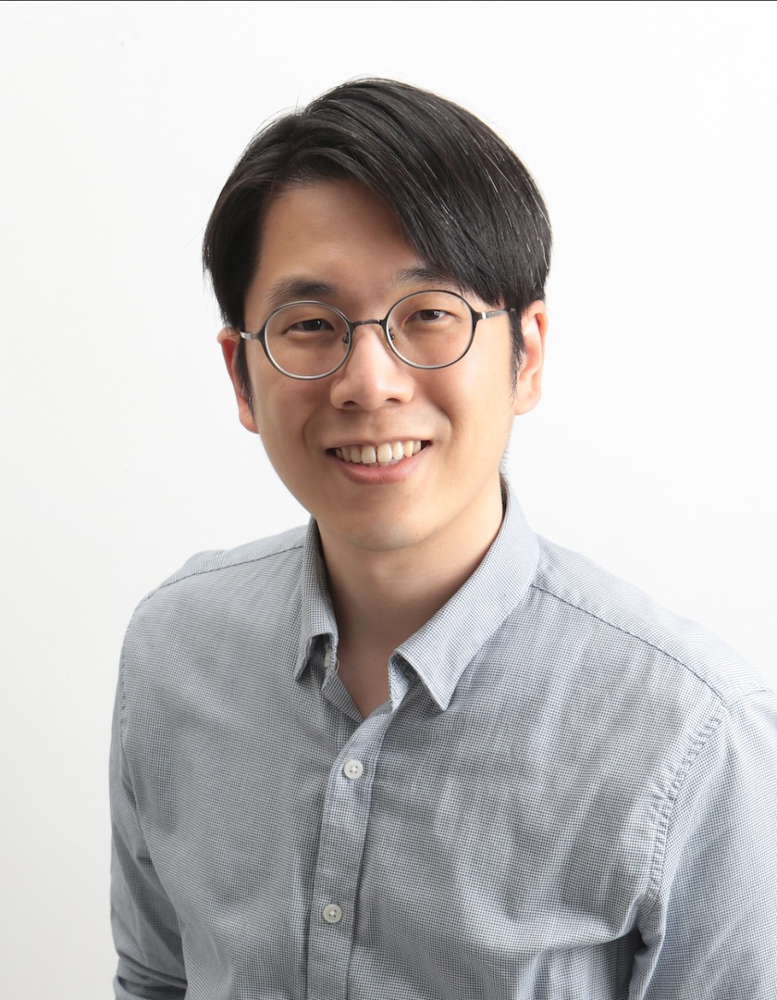 |
| [Francesca Giada Antonaci](francescagiada-antonaci/person.yaml) | Sep 2025–Dec 2025 | PhD Student | Polytechnic University of Turin | fga@mit.edu | 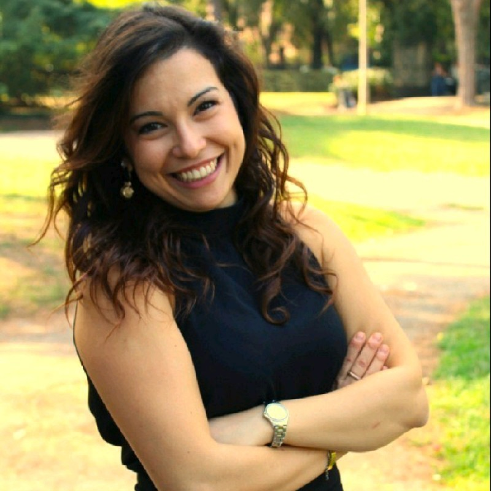 |
| [Hannes Ill](hannes-ill/person.yaml) | Nov 2025–Apr 2026 | Master's | Technical University of Munich | illh534@mit.edu | 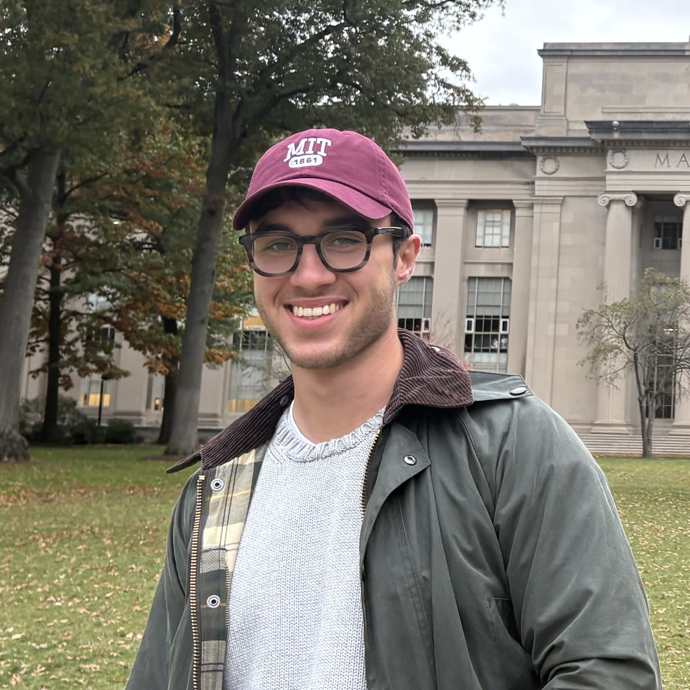 |
| [Lukas Liss](lukas-liss/person.yaml) | Jul 2025–Sep 2025 | PhD Student | RWTH Aachen University | lukasl@mit.edu | 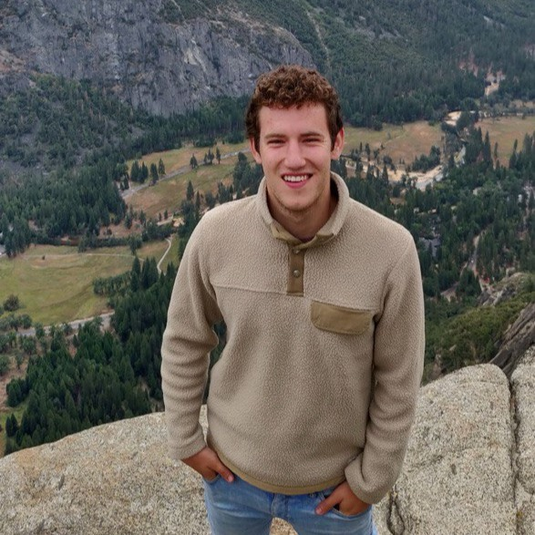 |
| [Norman Pedersen](norman-pedersen/person.yaml) | Sep 2025–Dec 2025 | PhD Student | University of Copenhagen | nkp@mit.edu | 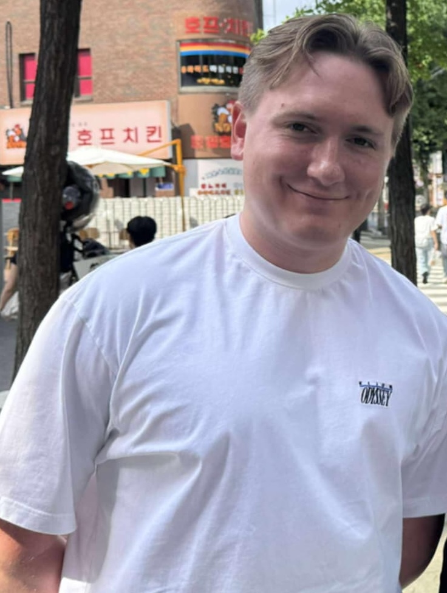 |
| [Rafi Al Attrach](rafi-attrach/person.yaml) | Mar 2025–Aug 2025 | Master's | Technical University of Munich | rafiaa@mit.edu | 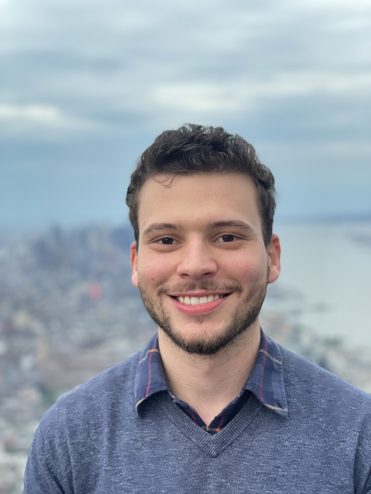 |
| [Rajna Fani](rajna-fani/person.yaml) | Mar 2025–Aug 2025 | Master's | Technical University of Munich | rajnaf@mit.edu | 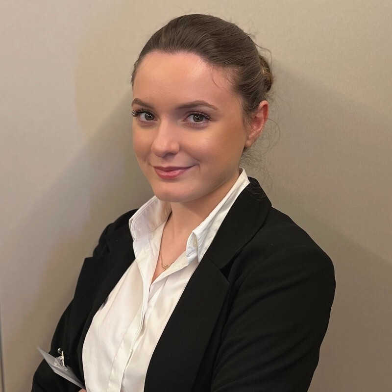 |
| [Shishuo Chen](shishuo-chen/person.yaml) | Nov 2025–Dec 2025 | Visiting Scientist |  | chocolidoo49@gmail.com | 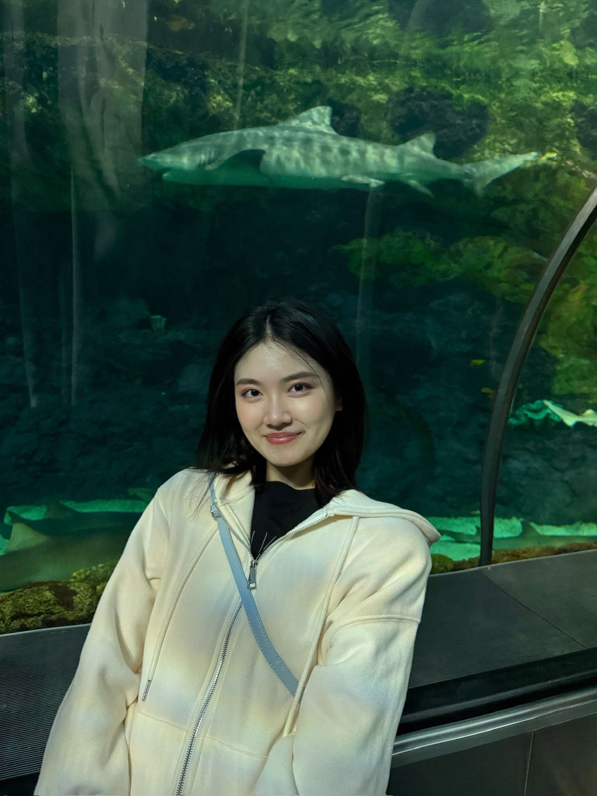 |
| [Takeshi Tohyama](takeshi-tohyama/person.yaml) | Apr 2024–Mar 2026 | Postdoc | MIT | ttohyama@mit.edu |  |
| [Xiao Xiang](xiao-xiang/person.yaml) | Apr 2025–Aug 2025 | Master's | EPFL | xiao0605@mit.edu | 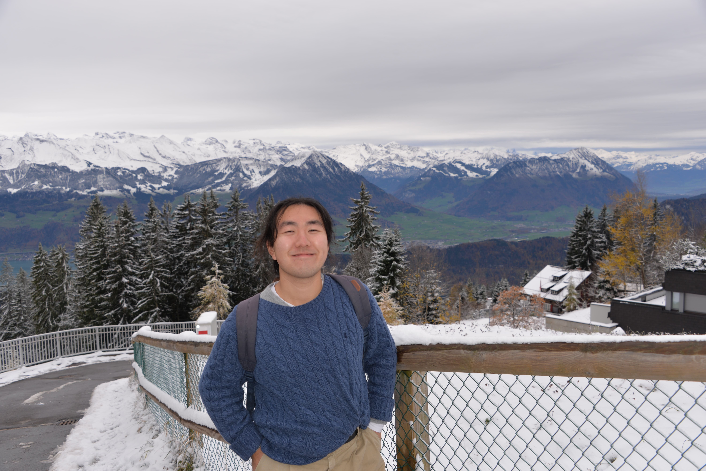 |

---
_Generated from `data/people/` — 36 records total._
